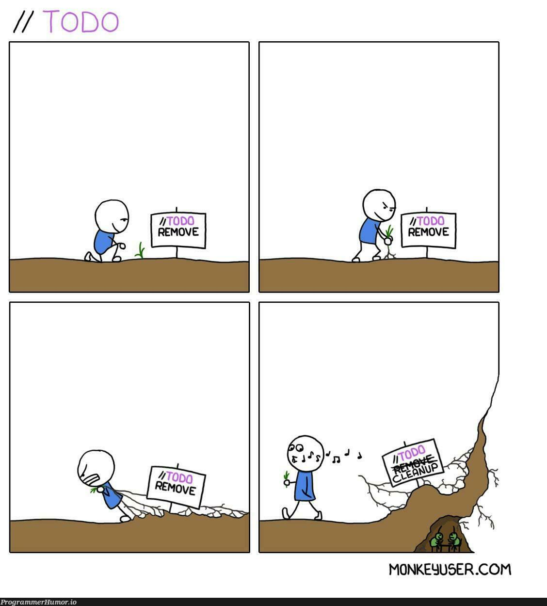
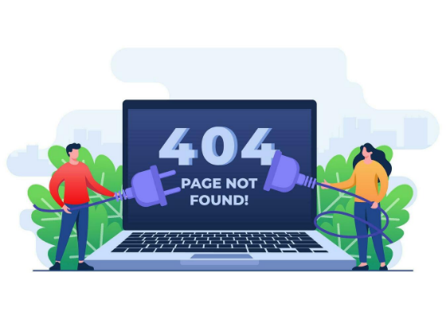
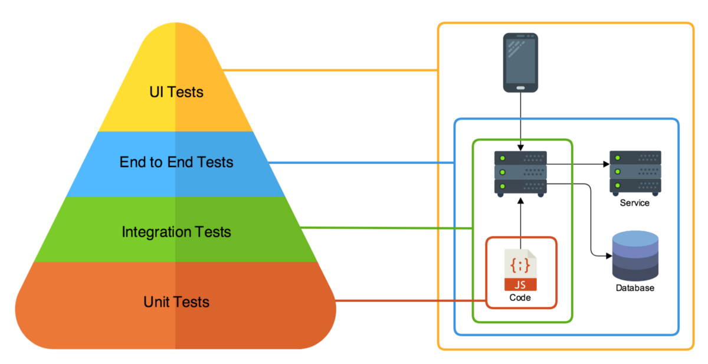
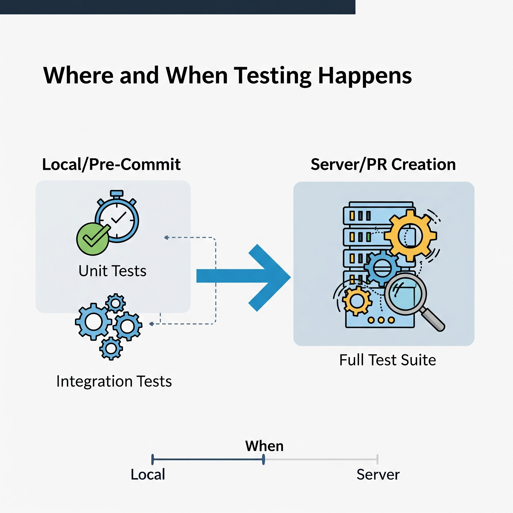
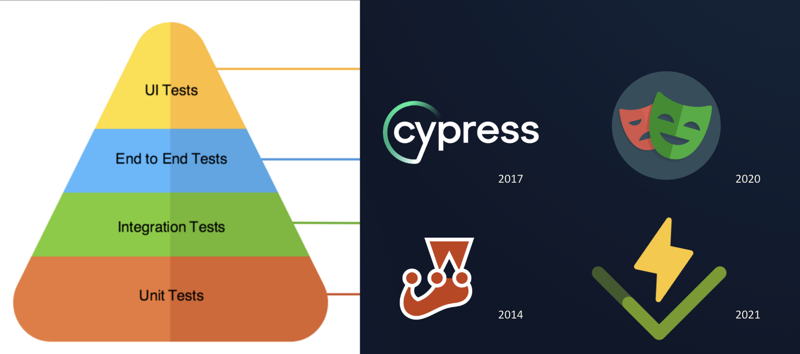
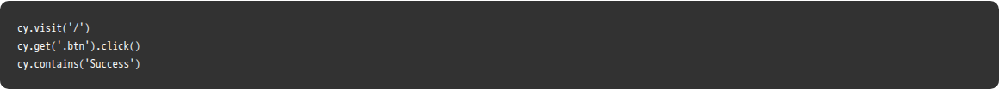
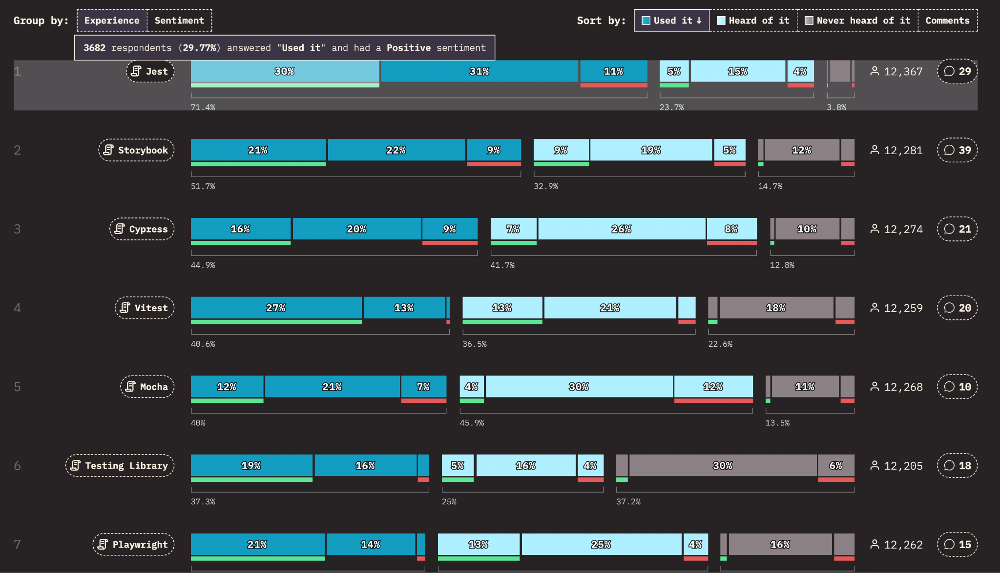
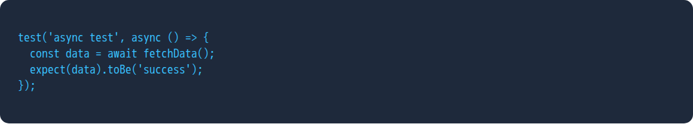
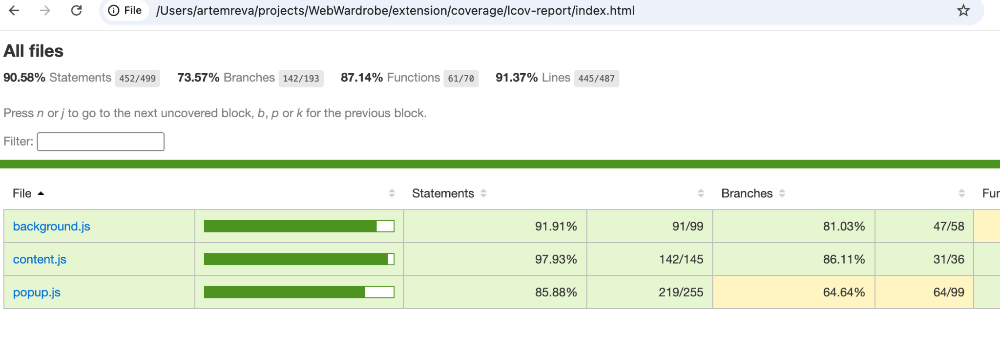
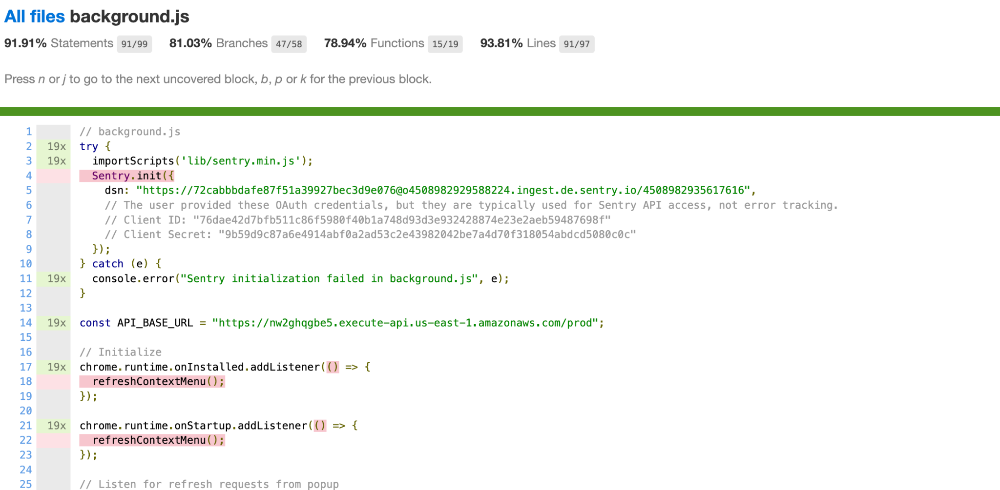

React Testing
Продвинутый уровень: RTL, Jest & E2E
Масштабируемое качество кода без страха регрессии

---

Раздел 1: Боль
Почему мы вообще пишем тесты?

---


КОШМАР РЕГРЕССИИ
Вы исправляете один баг, и неожиданно ломаются три других в совершенно разных частях приложения.
Результат: бесконечный цикл исправлений и потеря доверия заказчика.

---

НАША ГЛАВНАЯ ЦЕЛЬ
0
НОВЫХ БАГОВ В СТАРОМ КОДЕ
Мы хотим поставлять код максимально быстро, сохраняя 100% уверенность в том, что существующая функциональность работает.

---

Раздел 2: Стратегия
Как распределить усилия для максимального профита

---

ПИРАМИДА ТЕСТИРОВАНИЯ


E2E (Сквозные): Самые медленные и дорогие. Вершина.


Integration: Средняя скорость. Проверка связей.


Unit (Модульные): Самые быстрые и дешевые. Основание пирамиды.

---

SMOKE TESTS (ДЫМОВЫЕ)



Что это?
Минимальный набор тестов для подтверждения того, что приложение вообще запускается и основные пути не выдают 500 ошибку.

---

UNIT TESTS


Проверка изолированных "кирпичиков" кода (хуков, утилит).


Мгновенная обратная связь при разработке.


Не требуют запуска DOM или браузера (в идеале).

Функция

```
function calculateTax(amount) {
return amount \* 0.2;
}
module.exports = calculateTax;
```

unit test

```
const calculateTax = require('./calculateTax');
describe('calculateTax', () => {
    it('should return 20% of the input amount', () => {
        const result = calculateTax(100);
        expect(result).toBe(20);
    });
    it('should return 0 for an input of 0', () => {
    expect(calculateTax(0)).toBe(0);
    });
    it('should handle negative amounts', () => {
        expect(calculateTax(-50)).toBe(-10);
    });
});
```

---

INTEGRATION TESTS

```
import …
import App from '../App';
test('users can add a todo item which then appears in the list', async () => {
// 1. Сетап
const user = userEvent.setup();
render(<App />); // Рендер компонента
const addButton = screen.getByRole('button', { name: /add/i });
// 2. Действие
await user.type(input, 'Walk the dog');
await user.click(addButton);
// 3. Проверка
// findBy\* асинхронный
const todoItem = await screen.findByText('Walk the dog');
expect(todoItem).toBeInTheDocument();
expect(screen.getByRole('list')).toHaveTextContent('Walk the dog');
});
```

В React это часто означает тестирование группы компонентов. Мы проверяем, передает ли родитель данные ребенку и правильно ли срабатывают коллбэки.
Это "sweet spot" для React Testing Library.

---

E2E TESTS
Глазами пользователя
Тест кликает по реальным кнопкам, ждет ответа от реального сервера и проверяет UI.

## 

---

Когда и где запускаются тесты

локально pre-commit

на сервере при создании PR

## 

---

Раздел 3: Инструментарий

Что мы используем в 2025 году?

---

E2E ТЕСТЫ



---

JEST


- Стандарт индустрии

- Все-в-одном: тест-раннер, assertions, mocking.

- Огромное комьюнити.

- Встроен в Create React App.

https://jestjs.io/

---

VITEST


Преемник Jest для Vite
Работает в 10 раз быстрее за счет использования Vite dev server. Почти 100% совместим с API Jest.

https://vitest.dev/

---

REACT TESTING LIBRARY


"Тестируйте как пользователи, а не как разработчики"
Это библиотека для рендеринга и поиска элементов в DOM.

Работает как плагин в Jest или Vitest

https://testing-library.com/

---

CYPRESS


Инструмент для E2E. Позволяет "путешествовать во времени", видеть каждый шаг теста в браузере и легко отлаживать ошибки.


https://www.cypress.io

---

PLAYWRIGHT


Новый король E2E от Microsoft. Быстрее Cypress, поддерживает параллельность из коробки и все движки браузеров (Chromium, Firefox, WebKit).

https://playwright.dev/

---

State of JS 2024

## 

---

Раздел 4: Основы Jest/Vitest
Как писать логику тестов

---

ASSERTIONS (MATCHERS)

- toBe() Строгое равенство (===)

- toEqual() Глубокое равенство (для объектов/массивов)

- toContain() Проверка наличия в массиве

- toThrow() Проверка на выброс ошибки

---

ЖИЗНЕННЫЙ ЦИКЛ ТЕСТОВ

beforeEach()

Выполняется перед каждым тестом. Идеально для сброса стейта или моков.

afterAll()

Выполняется один раз в конце. Используется для закрытия соединений.

---

АСИНХРОННОСТЬ

## 

---

МОКИ (JEST.FN)
Нам часто нужно проверить, была ли вызвана функция и с какими аргументами, не запуская саму функцию.

---

МОКИ МОДУЛЕЙ
Позволяют подменить тяжелые зависимости (axios, firebase) на заглушки, чтобы тесты были быстрыми и предсказуемыми.

---

ПОКРЫТИЕ (COVERAGE)

```
"scripts": {
"test:coverage": "jest --coverage",
},
```


Команда --coverage покажет, какие строки вашего кода еще не протестированы.

---

ПОКРЫТИЕ (COVERAGE)
"scripts": {
"test:coverage": "jest --coverage",
}

## 

ПРАКТИКА #1: UNIT TEST
Задание:
Напишите функцию formatPrice(amount), которая добавляет знак "$" и округляет до 2 знаков. Напишите для нее 3 теста: для целого числа, для дробного и для нуля.
Время: 5 минут

---

Раздел 5: React Testing Library

Смерть Enzyme и рождение пользовательского подхода

---

ФИЛОСОФИЯ

- "
  "Чем больше ваши тесты похожи на то, как используется ваш софт, тем больше уверенности они вам дают."

---

МЕТОД RENDER()

Создает виртуальный DOM для вашего компонента. В отличие от Enzyme, он всегда делает полный рендеринг (deep render).

---

ОБЪЕКТ SCREEN

Единый интерфейс для поиска элементов в отрендеренном DOM. Больше не нужно деструктурировать результат render().

---

ПРИОРИТЕТ ЗАПРОСОВ

1. Доступность | getByRole
2. Формы | getByLabelText
3. Текст | getByText
4. Test ID | getByTestId (крайний случай)

---

ЗАЧЕМ GETBYROLE?


Тестирование = Доступность

Это заставляет вас писать доступный код. Если тест не может найти кнопку по роли button, значит и скринридер ее не найдет.

---

USER-EVENT VS FIREEVENT

fireEvent просто триггерит событие. user-event имитирует реальное поведение (например, при печати срабатывают keyDown, keyPress, keyUp).

Всегда используйте @testing-library/user-event.

---

ТЕСТИРОВАНИЕ ФОРМ

- Найдите input по label.

- Используйте user.type().

- Кликните на Submit.

- Проверьте появление сообщения об успехе.

---

ТЕСТИРОВАНИЕ СТЕЙТА

Мы никогда не проверяем component.state. Мы проверяем, что UI изменился после действия.
Например: после клика на "Open", в DOM должен появиться элемент модального окна.

---

АСИНХРОННЫЙ UI

- findBy...
  Возвращает промис. Ждет появления элемента (по умолчанию 1 сек).

- waitFor()
  Позволяет ждать выполнения любого условия (например, исчезновения лоадера).

---

Раздел 6: Сложные сценарии

Моки API, Провайдеры и Хуки

---

ОТЛАДКА ТЕСТОВ

Метод screen.debug() выведет текущее состояние DOM в консоль. Помогает понять, почему getBy не находит элемент.

---

Раздел 7: Сквозные тесты (E2E)

Последняя линия обороны

---

КОГДА ПИСАТЬ E2E?

- Авторизация и Регистрация.

- Процесс оформления заказа (Checkout).

- Критические бизнес-сценарии (Happy Path).

---

РАБОЧИЙ ПРОЦЕСС В CYPRESS


Cypress запускает ваше приложение в реальном браузере и дает вам полный контроль над ним через API cy.

---

РАБОЧИЙ ПРОЦЕСС В CYPRESS

- Это open-source фреймворк для end-to-end тестирования веб‑приложений, тесты пишутся на JavaScript или TypeScript.​

- Запускает тесты прямо в браузере, получая доступ к DOM и состоянию приложения.​

- Интерактивный Test Runner показывает выполнение тестов в реальном времени, поддерживает “time‑travel” отладку и детальные снимки ошибок.​

- Автоматически дожидается появления элементов и выполнения ожиданий, уменьшая необходимость в ручных задержках.​

- Интегрируется в CI/CD пайплайны и поддерживает несколько типов тестов (E2E, интеграционные, компонентные, API) в одном инструменте.​

---

ПОЧЕМУ PLAYWRIGHT?

- Это open‑source фреймворк от Microsoft для сквозного тестирования веб‑приложений с поддержкой Chromium, Firefox и WebKit через единый API.​

- Кроссплатформенный: тесты запускаются на Windows, Linux и macOS, локально и в CI, в обычном и headless‑режиме.​

- Поддерживает несколько языков (TypeScript/JavaScript, Python, .NET, Java), что упрощает внедрение в разные стек‑команды.​

- Встроенный раннер даёт автоожидания, проверки, трассировки, скриншоты и видео.​

- Контексты браузера и фикстуры обеспечивают изоляцию тестов, интеграцию с CI/CD.​

---

ПОЧЕМУ PLAYWRIGHT?

- Многопоточность

- Авто-ожидание

- Трассировка

- Запуск 10 тестов одновременно.

- Меньше "падающих" тестов.

- Запись видео и шагов теста.

---

VISUAL REGRESSION

Сравнение скриншотов "было" и "стало". Позволяет заметить, что кнопка съехала на 2 пикселя влево.

---

Спасибо!
Время вопросов и ответов
